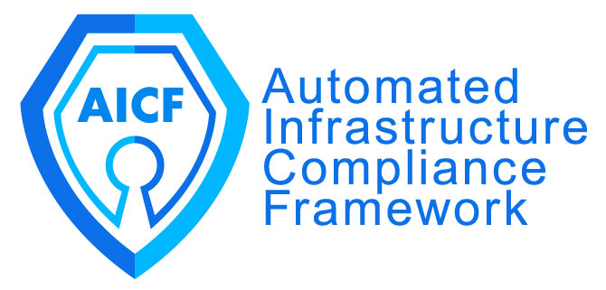

**For help, email aicf@nltgis.com**

## What is AICF?
The Automated Infrastructure Compliance Framework is an open-source integrated pipeline for deploying and monitoring infrastructure. Specific features include:
* Pre-deployment policy checking using Open Policy Agent
* Post-deployment AWS/Azure drift detection using Fugue.co
* Terraform for Infrastructure-as-Code deployments

# AICF docker action

This GitHub Action executes an AICF run which runs a pre-deployment policy check against one's terraform infrastructure as code, deploys the terraform code in a cloud provider (aws, azure or gcp) and enables drifit detection upon completion of cloud resource build out. One glaring feature, not yet available, is the capability to manually trigger an action.  

We've worked around this by specifying the action trigger in the example workflow on a push to a non-default branch, i.e. "deployment". Therefore your "master" branch won't clutter with commits that are used to trigger actions.  

**Please ensure all of your Terraform "*.tf" files are in a repo top level folder called `terraform`.**    

To gain a better understanding of the AICF and how it can be an effective in tool for your organization, please visit: https://aifc.nltgis.com.  
 
 

## Inputs

### `tfcommand`
**Required** Terraform sub command to run.

### `cloudprovider`
**Required** Cloud provider TF will deploy to.

### `terraformcloudtoken`
**Required** Terraform Cloud Token. Also a secret in next section.

### `fugueenvironmentid`
**Required** Fugue Environment ID. Also a secret in next section.

### `fugueclientid`
**Required** Fugue Client ID. Also a secret in next section.

### `fugueclientsecret`
**Required** Fugue Client secret. Also a secret in next section.

### `terraformsha256`
**Required** Sha256 hash of TF binary. Default `602d2529aafdaa0f605c06adb7c72cfb585d8aa19b3f4d8d189b42589e27bf11`.

### `terraformversion`
**Required** TF version. Default `0.12.24`.

### `intervalinseconds`
**Required** Fugue scan interval in seconds. Default `86400`.

### `regulaversion`
**Required** Version of Regula binary, Default `0.3.0`.

### `opaversion`
**Required** Version of Open Policy Agent. Default `0.18.0`.
 

## Secrets (must be predefined in GitHub repo settings)

### `TERRAFORMCLOUDTOKEN`
Terraform cloud token

### `FUGUEENVIRONMENTID`
Fugue Environement specific ID

### `FUGUECLIENTID`
Fugue Client ID

### `FUGUECLIENTSECRET`
Fugue Client Secret
 

## Example usage

    # This workflow is triggered on pushes to the repository's deployment branch.
    on:
    push:
        branches:
        - deployment

    jobs:
    build:
        # Job name is Run
        runs-on: ubuntu-latest
        name: Run
        steps:
        - name: Repo checkout
            uses: actions/checkout@master
        - name: AICF GitHub Action
            uses: nltgit/aicf-action@master
            with:
                # tfcommands {apply or destroy}
                tfcommand: apply
                # cloudprovider {aws, azure, gps}
                cloudprovider: aws
                terraformcloudtoken: ${{ secrets.TERRAFORMCLOUDTOKEN }}
                fugueenvironmentid: ${{ secrets.FUGUEENVIRONMENTID }}
                fugueclientid: ${{ secrets.FUGUECLIENTID }}
                fugueclientsecret: ${{ secrets.FUGUECLIENTSECRET }}
 

## Contributing
1) Clone repo  
2) Create new branch, make changes and commit and push to remote i.e. `git push --set-upstream origin new-branch`  
3) Log into GitHub and create pull request to the master branch

## Contact  
New Light Technologies, Inc.   
Carl Alleyne - carl.alleyne@nltgis.com
